# Question 1

## Alpha 0.5
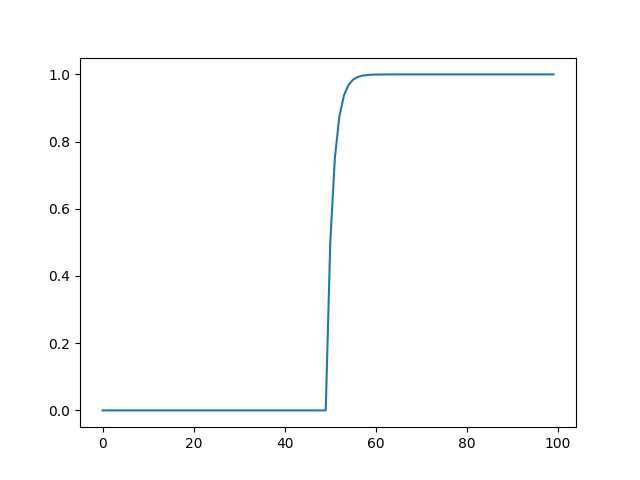

## Alpha 0.01
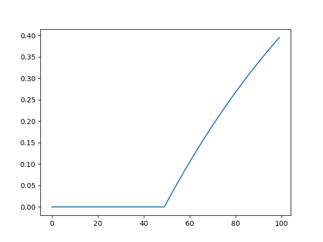

## Explanation

As seen in the graphs above, a higher alpha value makes the mean_rtt converge quicker to the current situation of the network. With an alpha of 0.5, the mean_rtt value reached 1 at around the 60th sample (which means it only needed 1/5 of the RTT 1 samples to converge to 1), whereas a small alpha of 0.01 reached the same value after the 100th RTT sample (after receiving all 50 RTT samples of 1).
This makes sense when following the equation of the ewma filter, which is a weighted sum of the current value for mean_rtt and the newly received value. The weights are defined by alpha, and a higher alpha means that the new value is going to be multiplied by alpha and then added to the current mean_rtt value after being multiplied by 1-alpha. This weighted sum setup favors the newly received values in the long run, but the degree
to which they influence the mean_rtt value directly comes from the weights assigned to the new samples, which is defined by alpha in the EWMA filter.
## Question 1.2
See **Question 4: Congestion Collapse** where I modified the min and max timeouts.

# Question 2
## Question 2.1

Proof that the stop and wait host implementation works can be found on ```figures/Q2-2-1.png```.
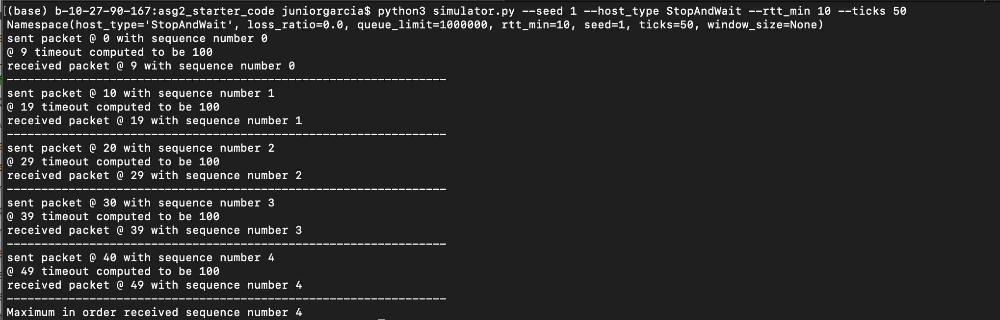

## Question 2.2

For this question, I used two different experimental setups. One where the number of ticks in the network is 50 and another where the number of ticks in the networks is 200. 
I did this just to double check that both the observed throughput and the expected throughput matched under different experimental setups.
Below is the code I used to generate both:

### 50 ticks Graph:

#### Command

```
python3 simulator.py --seed 1 --host_type StopAndWait --rtt_min [DESIREDRTT] --ticks 50
```

#### Graph
Located in ```figures/Q2-2_ticks50.png```

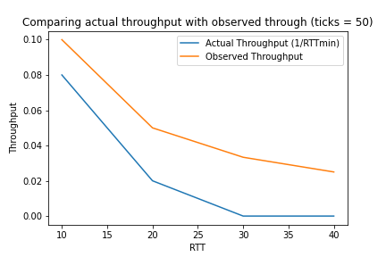

#### Code
```python
'''
Ticks = 50
'''
import matplotlib.pyplot as plt
# line 1 points
RTTx = [10,20,30,40]
observerdThroughputy = [4/50,1/50,0,0]
actualThroughputy = [1/10,1/20,1/30,1/40]
# plotting actual throughput
plt.plot(RTTx , observerdThroughputy, label = "Actual Throughput (1/RTTmin)")
# plotting  observed throughput
plt.plot(RTTx,actualThroughputy, label = "Observed Throughput")
plt.xlabel('RTT')
# Set the y axis label of the current axis.
plt.ylabel('Throughput')
# Set a title of the current axes.
plt.title('Comparing actual throughput with observed through (ticks = 50)')
# show a legend on the plot
plt.legend()
plt.savefig('Q2-2_ticks50.png')
# Display a figure.
plt.show()

```

### 200 ticks Graph:

#### Command
```
python3 simulator.py --seed 1 --host_type StopAndWait --rtt_min [DESIREDRTT] --ticks 100
```

#### Graph
Located in ```figures/Q2-2_ticks200.png```
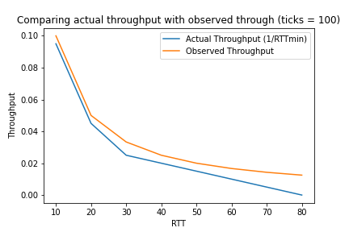

#### Code
```python
'''
Ticks = 200
'''
import matplotlib.pyplot as plt
# line 1 points
RTTx = [10,20,30,40,50,60,70,80]
observerdThroughputy = [19/200,9/200,5/200,4/200,3/200,2/200,1/200,0]
actualThroughputy = [1/10,1/20,1/30,1/40,1/50,1/60,1/70,1/80]
# plotting actual throughput
plt.plot(RTTx , observerdThroughputy, label = "Actual Throughput (1/RTTmin)")
# plotting  observed throughput
plt.plot(RTTx,actualThroughputy, label = "Observed Throughput")
plt.xlabel('RTT')
# Set the y axis label of the current axis.
plt.ylabel('Throughput')
# Set a title of the current axes.
plt.title('Comparing actual throughput with observed through (ticks = 100)')
# show a legend on the plot
plt.legend()
plt.savefig('Q2-2_ticks200.png')
# Display a figure.
plt.show()
```

However, due to the small time for the simulation, I believe there was not enough time for the observed throughputs to converge to the expected throughput. As such, doing the simulation for 1000 ticks creates a better match between the observed throughput plot and the expected throughput plot.

### 1000 ticks Graph

#### Command
```
python3 simulator.py --seed 1 --host_type StopAndWait --rtt_min [DESIREDRTT] --ticks 1000
```

#### Graph
Located in ```figures/Q2-2_ticks1000.png```


#### Code

```python
'''
Ticks = 1000
'''
import matplotlib.pyplot as plt
# line 1 points
RTTx = [10,20,30,40,50,60,70,80]
observerdThroughputy = [99/1000,49/1000,32/1000,24/1000,19/1000,16/1000,13/1000,11/1000]
actualThroughputy = [1/10,1/20,1/30,1/40,1/50,1/60,1/70,1/80]
# plotting actual throughput
plt.plot(RTTx , actualThroughputy, label = "Actual Throughput (1/RTTmin)")
# plotting  observed throughput
plt.plot(RTTx,observerdThroughputy, label = "Observed Throughput")

plt.xlabel('RTT')
# Set the y axis label of the current axis.
plt.ylabel('Throughput')
# Set a title of the current axes.
plt.title('Comparing actual throughput with observed throughput\n (ticks = 1000)')
# show a legend on the plot
plt.legend()
plt.savefig('Q2-2_ticks1000.png')
# Display a figure.
plt.show()

```


## Question 2.3

### Question 2.3.1

#### Command

```
python3 simulator.py --seed 1 --host_type StopAndWait --rtt_min [DESIREDRTT] --ticks 1000 --loss_ratio 0.01
```
#### Graph
Located in ``` figures/Q2-3-1.png```

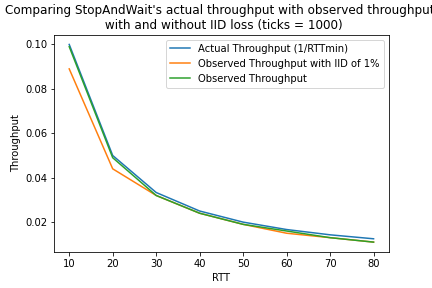

#### Code

```python
'''
With and Without IID loss of 0.01
Ticks = 1000
'''
import matplotlib.pyplot as plt
# line 1 points
RTTx = [10,20,30,40,50,60,70,80]
observerdThroughputy = [99/1000,49/1000,32/1000,24/1000,19/1000,16/1000,13/1000,11/1000]
observerdThroughputwithlossy = [89/1000,44/1000,32/1000,24/1000,19/1000,15/1000,13/1000,11/1000]
actualThroughputy = [1/10,1/20,1/30,1/40,1/50,1/60,1/70,1/80]
# plotting actual throughput
plt.plot(RTTx , actualThroughputy, label = "Actual Throughput (1/RTTmin)")
# plotting  observed throughput with loss
plt.plot(RTTx,observerdThroughputwithlossy, label = "Observed Throughput with IID of 1%")
# plotting  observed throughput
plt.plot(RTTx,observerdThroughputy, label = "Observed Throughput")

plt.xlabel('RTT')
# Set the y axis label of the current axis.
plt.ylabel('Throughput')
# Set a title of the current axes.
plt.title("Comparing StopAndWait's actual throughput with observed throughput \n with and without IID loss (ticks = 1000)")
# show a legend on the plot
plt.legend()
plt.savefig('Q2-3-1.png')
# Display a figure.
plt.show()
```

#### Explanation
 Given how the loss ratio is only 1%, the observed throughput with IID loss still manages to be close to the expected thorughput and the observed throughput with no loss from the **Question 2.2**. However, there is a noticeable decrease in throughput. This is due to the fact that if a packet is lost at tick A, the network is at a stand still until the sender retransmits the packet at tick A+timeout as it is still waiting for an acknowledgement during ticks in the range [A, A+timeout]. However, the graph above shows that the difference between the 
 observed throughput with IID loss of 1% and the observed throughput with no loss decreases as RTT increases. This is due to the fact that a larger RTT means that there are fewer packets being transmitted in the network, hence reducing the number of packets that could be randomly lost. 


### Question 2.3.2
Proof that the protocol is able to retransmit packets that are then acknowledged by the receiver can be found on: ```figures/Q2-3-2.png```.

**Command**: ```python3 simulator.py --seed 1 --host_type StopAndWait --rtt_min [DESIREDRTT] --ticks 1000 --loss_ratio 0.5```

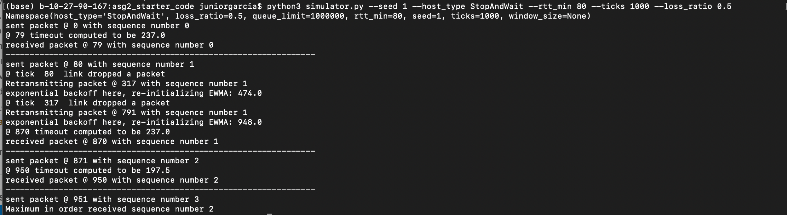

As shown in the graph above, the network simulator dropped the packet with sequence number 1 at tick 80, which was retransmitted and then eventually received by the receiver at tick 870. This delay in receiving the packet is due to the high loss ratio chosen for this particular experiment, which mean that the packet was retransmitted by the sender several times but the network kept on dropping it.


# Question 3

## Question 3.1
Proof that the sliding window host implementation works can be found on ```figures/Q3-1.png```.

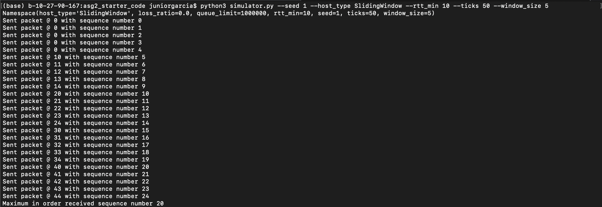

## Question 3.2

#### Command

```
python3 simulator.py --seed 1 --host_type SlidingWindow --rtt_min [DESIREDRTT] --ticks 1000 --window_size 5
```

#### Graph 
Graph that compares the actual throughput with the observed throughput for the sliding window protocol can be located at ```figures/Q3-2.png```.

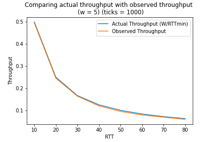

#### Code

```python
'''
W=5
Ticks = 1000
'''
import matplotlib.pyplot as plt
RTTx = [10,20,30,40,50,60,70,80]
observerdThroughputy = [495/1000,245/1000,164/1000,120/1000,95/1000,79/1000,69/1000,59/1000]
actualThroughputy = [5/10,5/20,5/30,5/40,5/50,5/60,5/70,5/80]

# plotting actual throughput
plt.plot(RTTx , actualThroughputy, label = "Actual Throughput (W/RTTmin)")
# plotting  observed throughput
plt.plot(RTTx,observerdThroughputy, label = "Observed Throughput")

plt.xlabel('RTT')
# Set the y axis label of the current axis.
plt.ylabel('Throughput')
# Set a title of the current axes.
plt.title('Comparing actual throughput with observed throughput \n (w = 5) (ticks = 1000)')
# show a legend on the plot
plt.legend()
plt.savefig('Q3-2.png')
# Display a figure.
plt.show()

```

## Question 3.3

### Question 3.3.1

#### Command
```
python3 simulator.py --seed 1 --host_type SlidingWindow --rtt_min [DESIREDRTT] --ticks 1000 --window_size 5 --loss_ratio 0.01
```

#### Graph
Located in ```figures/Q3-3-1.png```

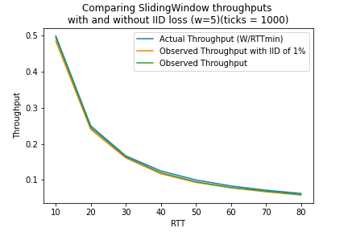


#### Code

```python
'''
W=5
Ticks = 1000
with and withoud IID Loss of 0.01
'''
import matplotlib.pyplot as plt
# line 1 points
RTTx = [10,20,30,40,50,60,70,80]
observerdThroughputy = [495/1000,245/1000,164/1000,120/1000,95/1000,79/1000,69/1000,59/1000]
observerdThroughputwithlossy = [485/1000,240/1000,161/1000,117/1000,93/1000,78/1000,67/1000,58/1000]
actualThroughputy = [5/10,5/20,5/30,5/40,5/50,5/60,5/70,5/80]
# plotting actual throughput
plt.plot(RTTx , actualThroughputy, label = "Actual Throughput (W/RTTmin)")
# plotting  observed throughput with loss
plt.plot(RTTx,observerdThroughputwithlossy, label = "Observed Throughput with IID of 1%")
# plotting  observed throughput
plt.plot(RTTx,observerdThroughputy, label = "Observed Throughput")

plt.xlabel('RTT')
# Set the y axis label of the current axis.
plt.ylabel('Throughput')
# Set a title of the current axes.
plt.title(" SlidingWindow\nComparing actual throughput with observed throughput\n with and without IID loss \n (w=5)(ticks = 1000)")
# show a legend on the plot
plt.legend()
plt.savefig('Q3-3-1.png')
# Display a figure.
plt.show()


```

#### Explanation

Similar to  **Question 2.3.1**, there is small, albeit almost visually indectatable, decrease in throughput when the IID loss is introduced. Just like in StopandWait, a larger RTT means that there are less packets in the network that could be dropped and as such, the difference in throughput eventually disappears with a larger RTT. As we discussed in class, Stop and Wait is basically Sliding Window with a window size of 1 and hence should behave similar at least in the context of this question. 

### Question 3.3.2
Proof that the sliding window host is able to work properly despite loss and retransmission of packets can be found on: ```figures/Q3-3-2.png```. Notice how at tick 32, the network dropped the packet 17, which is then retransmitted at tick 132. 
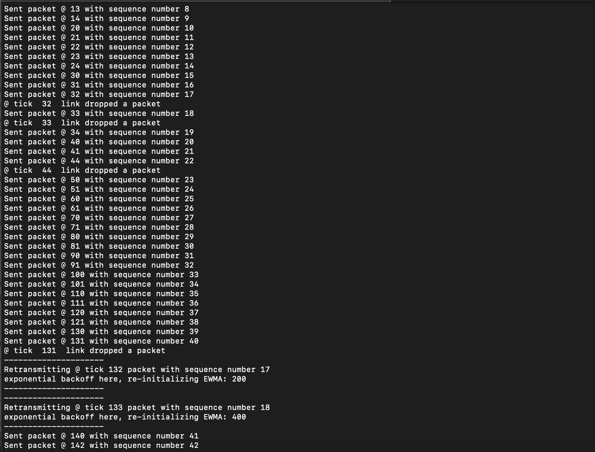


# Question 4 

## Withh normal min and max

#### Command

```
python3 simulator.py --seed 1 --host_type SlidingWindow --rtt_min 10 --ticks 10000 --window_size [VARYING WINDOW SIZE] 
```

#### Data Collection

**BDP**= 10
```

ticks = 10000
RTTmin = 10
window_sizes = 
[1,# y
2,#
5,#
7,#
10,#
20,#
40 #,
80,
100,
200,
400,
800,
1000
]
# throughput = packets_sent_and received/ticks
observedthroughputs = [
999/10000,
1998/10000,
4995,10000.
6993/10000,
9990/10000,
9990/10000,
9990/10000,
9990/10000,
9850/10000,
9438/10000,
9284/10000,
8612/10000,
8301/10000


]
# w/RTT
expectedthroughput = [1/10,2/10,5/10,7/10,10/10,20/10,40/10,80/10,200/10,400/10,800/10,1000/10]
originalpacketssent = [
1000,
2000,
5000,
7000,
10000,
10010,
10030,
10070,
9950,
9638,
9684,
9412,
9301

]
originalpacketsreceived = 
[1000,
1999,
4996,
6994,
9991,
9991,
9991,
9991,
9851,
9439,
9285,
8613,
8302


]
retransmissionpacketssent = [
0,
0,
0,
0,
0,
0
0,
0,
140,
748,
706,
1378,
1689,


]
retransmissionpacketsreceived = [
0,
0,
0,
0,
0,
0,
0,
0,
140,
552,
706,
1378,
1689
]

```
#### Graph

The congestion collapse graph can be located in ```figures/congestioncollapse.png```
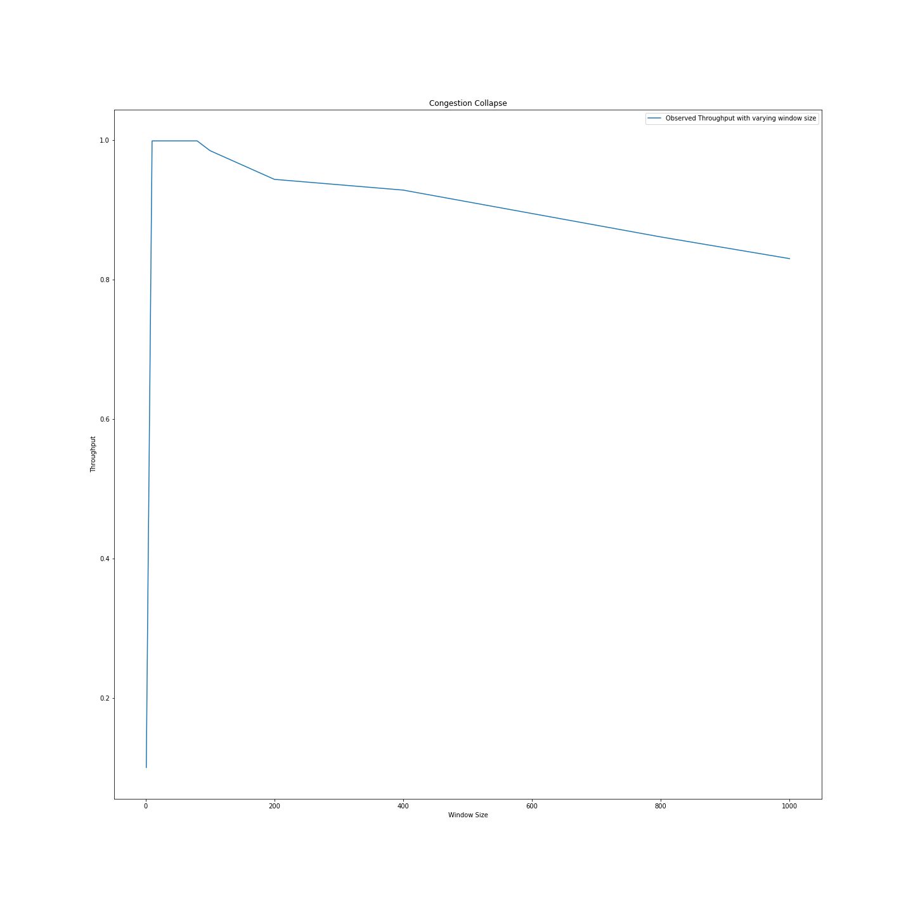

#### Code

```python
'''
Visualizing Congestion Collapse
'''
import matplotlib.pyplot as plt
import numpy as np

plt.rcParams["figure.figsize"] = (20,20)

# line 1 points
window_sizesX = [1,
2,
5,
7,
10,
20,
40,
80,
100,
200,
400,
800,
1000
]
observedthroughputsY = [
999/10000,
1998/10000,
4995/10000,
6993/10000,
9990/10000,
9990/10000,
9990/10000,
9990/10000,
9850/10000,
9438/10000,
9284/10000,
8612/10000,
8301/10000
]

expectedthroughputsY = [1/10,2/10,5/10,7/10,10/10,20/10,40/10,80/10,100/10,200/10,400/10,800/10,1000/10]
# plotting actual throughput
# plotting  observed throughput with loss
plt.plot(window_sizesX,observedthroughputsY, label = "Observed Throughput with varying window size")

plt.xlabel('Window Size')
# Set the y axis label of the current axis.
plt.ylabel('Throughput')
# Set a title of the current axes.
plt.title("Congestion Collapse")
# show a legend on the plot
plt.legend()

plt.savefig('congestioncollapse.png')
# Display a figure.
plt.show()


```

### With modified normal min and max (to answer 1.2)

**MIN_TIMEOUT** = 0

A smaller mintimeout increases the frequency of retransmission because they are not limited by an otherwise higher lower bound limit. This higher frequency increases the total number of retransmissions that occur under a specific time frame, hence clogging the network with duplicate packets and decreasing its overall utility. Below you can see the congestion collapse scenario that occurs with a smaller mintimeout. 

#### Code 

```python
'''
Visualizing Congestion Collapse with modified MIN and MAX TIMEOUT
MIN TIMEOUT = 0
MAX TIMOUT = 1000
'''
import matplotlib.pyplot as plt
import numpy as np

plt.rcParams["figure.figsize"] = (20,20)

# line 1 points
window_sizesX = [1,
2,
5,
7,
10,
20,
40,
80,
100,
200,
400,
800,
1000
]

# mintimeout = 0
observedthroughputsY = [
999/10000,
1995/10000,
4963/10000,
6888/10000,
9585/10000,
9195/10000,
8714/10000,
8187/10000,
7878/10000,
7355/10000,
5327/10000,
1599/10000,
999/10000

]

expectedthroughputsY = [1/10,2/10,5/10,7/10,10/10,20/10,40/10,80/10,100/10,200/10,400/10,800/10,1000/10,2000/10,4000/10]
# plotting actual throughput
# plt.plot(window_sizesX  , expectedthroughputsY , label = "Actual Throughput (W/RTTmin)")
# plotting  observed throughput with loss
plt.plot(window_sizesX,observedthroughputsY, label = "Observed Throughput with varying window size")

plt.xlabel('Window Size')
# Set the y axis label of the current axis.
plt.ylabel('Throughput')
# Set a title of the current axes.
plt.title("Congestion Collapse")
# show a legend on the plot
plt.legend()

plt.savefig('congestioncollapsemintimeout0.png')
# Display a figure.
plt.show()
```

#### Graph
Located in ```figures/congestioncollapsemintimeout0.png```

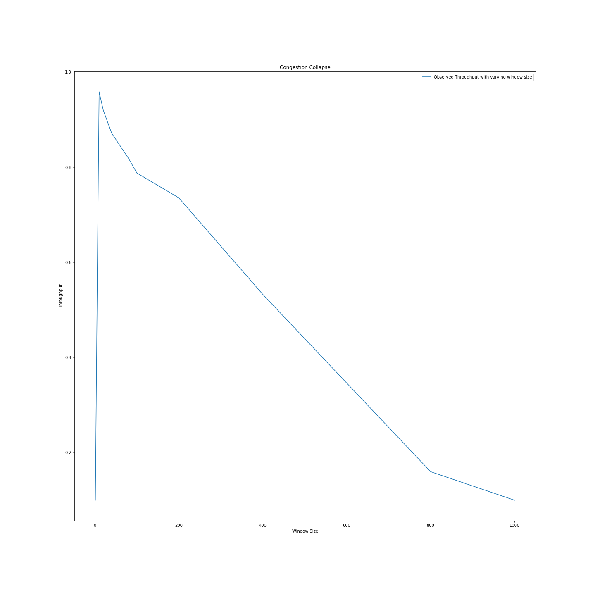


**NO MAX_TIMEOUT**

I also noticed a difference when disabling the ```MAX_TIMEOUT``` variable in ```timeout_calculator.py``` but only after I extended the number of ticks of the simulation. Since there is no max timeout, the timeout chosen for some packets can be scheduled way into the future, hence increasing throughput and reducing the number of retransmissions that occurs during the timeframe (number of ticks) specified in the graph below. However, scheduling retransmissions at will with no limit decreases the utility if we take the user in mind, who most likely will not like to take part in a network that takes an undefined large amount of time to deliver packets.

#### Code

```python
'''
Visualizing Congestion Collapse with modified MIN and MAX TIMEOUT
MIN TIMEOUT = 100
No MAX TIMEOUT
'''
import matplotlib.pyplot as plt
import numpy as np

plt.rcParams["figure.figsize"] = (20,20)

# line 1 points
window_sizesX = [1,
2,
5,
7,
10,
20,
40,
80,
100,
200,
400,
800,
1000
]

# ticks = 15000
observedthroughputsY15000 = [
1499/15000,
2998/15000,
7495/15000,
10493/15000,
14990/15000,
14990/15000,
14990/15000,
14990/15000,
14850/15000,
13484/15000,
14284/15000,
13612/15000,
13301/15000
]

observedthroughputsY10000 = [
999/10000,
1998/10000,
4995/10000,
6993/10000,
9990/10000,
9990/10000,
9990/10000,
9990/10000,
9850/10000,
9438/10000,
9284/10000,
8612/10000,
8301/10000
]


# 9284/10000 = 0.92
# 18588/20000 = 0.9294
expectedthroughputsY = [1/10,2/10,5/10,7/10,10/10,20/10,40/10,80/10,100/10,200/10,400/10,800/10,1000/10,2000/10,4000/10]
# plotting actual throughput
# plt.plot(window_sizesX  , expectedthroughputsY , label = "Actual Throughput (W/RTTmin)")
# plotting  observed throughput with loss
plt.plot(window_sizesX,observedthroughputsY10000, label = "Observed Throughput with varying window size (ticks = 10000)")
plt.plot(window_sizesX,observedthroughputsY15000, label = "Observed Throughput with varying window size (ticks = 15000)")

plt.xlabel('Window Size')
# Set the y axis label of the current axis.
plt.ylabel('Throughput')
# Set a title of the current axes.
plt.title("Congestion Collapse")
# show a legend on the plot
plt.legend()

plt.savefig('congestioncollapsnomaxtimeout.png')
# Display a figure.
plt.show()

```
#### Graph
Located in ```figures/congestioncollapsnomaxtimeout.png```

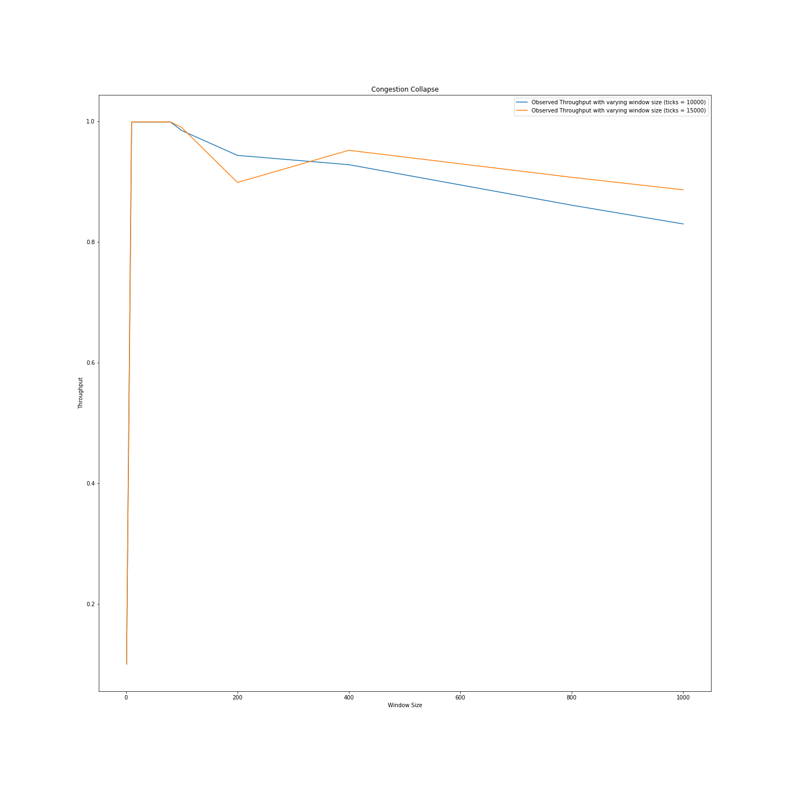


## Original and Retransmitted packets

I also noticed a difference in the number of original and retransmitted packets, which can be appreciated in the following graph```figures/originalandretransmitted```.
      


    
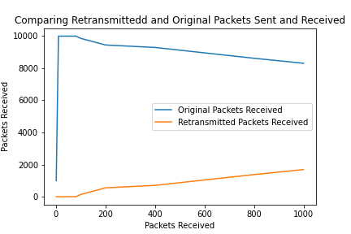

The number of retransmission increased as a function of the increasing window size while the inverse held truth for the number of original packets. Furthermore, although the ratio of received retransmission was almost perfect (i.e packets that were retransmitted were received by the reciever), this did not hold for the number of original packets sent. I believe this is due to the fact that although the retransmitted packet were received,they were duplicate packets that did not contribute to the overall utility of the network.
Hence, congestion collapse is caused by a high number of retransmitted duplicates that do not contribute to the network's utility and in fact keeps it from doing its purpose of providing in-order delivery of packets.

# Question 5

## 5.2
In order to ensure that the sawtooth pattern manifests itself in our simulation of the network, it is important that we
implement the multiplicative decrease logic so that it decreases after an RTT. If not, then we would see a graph that would decrease 
all the time to the point of creating a stagnant horizontal line during the congestion avoidance part of the AIMD algorithm
(as opposed to the sawtooth pattern that we now see).

## 5.3
#### Command
```
python3 simulator.py --seed 1 --host_type  Aimd --rtt_min 10 --ticks 10000 --queue_limit 10
```

AIMD Graph:
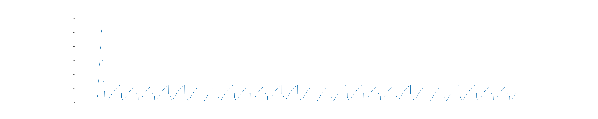
Throughput: 8199/10000   
Period of sawtooth: approximately 400 ticks  


## 5.4

## 0.5 BDP 

#### Command 
```
python3 simulator.py --seed 1 --host_type  Aimd --rtt_min 10 --ticks 10000 --queue_limit 5
```

#### Results

**Queu Limit:** 5
**Throughput :** 6727/10000

## 1 BDP
#### Command 
```
python3 simulator.py --seed 1 --host_type  Aimd --rtt_min 10 --ticks 10000 --queue_limit 10
```

#### Results
**QUEUE Limit:** 10
**Throughput:** 8199/10000

## 2 BDP 
#### Command 
```
python3 simulator.py --seed 1 --host_type  Aimd --rtt_min 10 --ticks 10000 --queue_limit 20
```

#### Results
**QUEUE Limit:** 20       
**Throughput:** 9710/10000

## 3BDP
#### Command 
```
python3 simulator.py --seed 1 --host_type  Aimd --rtt_min 10 --ticks 10000 --queue_limit 30
```

#### Results

**QUEUE Limit:** 30    
**Throughput:** 9965/10000

The throughput increases incrementally when increasing the queue limit. This is due to the fact that we are increasing the capacity of packets that the link can support, hence allowing the AIMD algorith to accomodate to the better hardware available to the
network. We can also see this effect in the graph as well. The period of the sawtooths increased (i.e. the lenght of each sawtooth), which tells us that the link is able to better withstand the linear growth of the window size with a hiqher queue capacity, hence increasing the time when the window constantly doubles during the slow start part of the algorithm.


## 5.5
The queue refers to the number of packets that the link can hold on the hardware side of things. As such, for the AIMD algorithm to resemble the expected throughput, the queue needs to be able to withstand the slow start part of the algorithm where the AIMD algorithm tests the limits of the link by exponentially increasing the window size. If the aforementioned holds true, then the overall utility of the network will resemble the ideal scenario where we have good hardware that wihstands a growing number of packets. This however is far from the truth, and the AIMD algorithm will most likely never realize its potential due to the limitations imposed by the link.