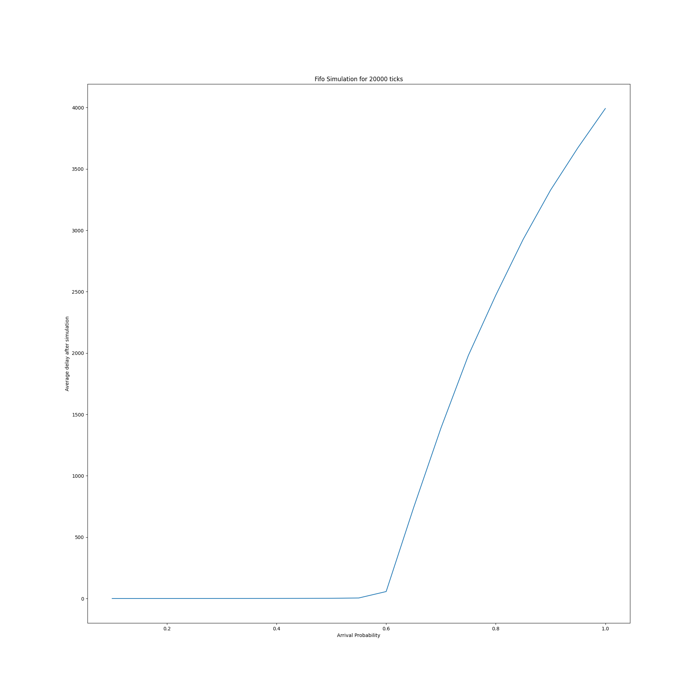
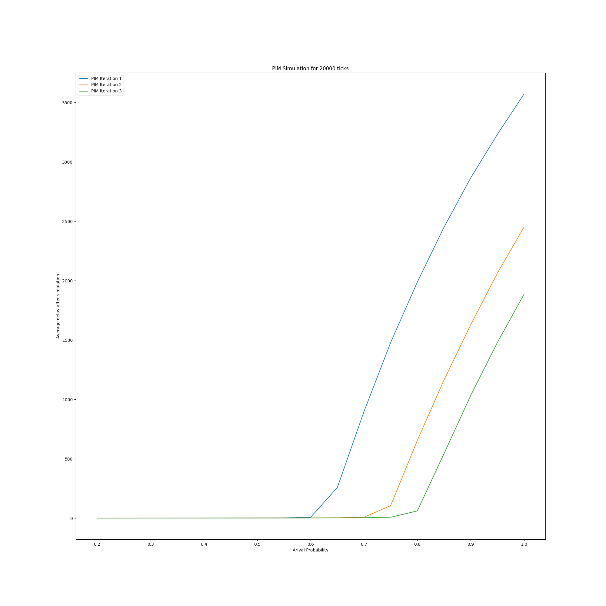
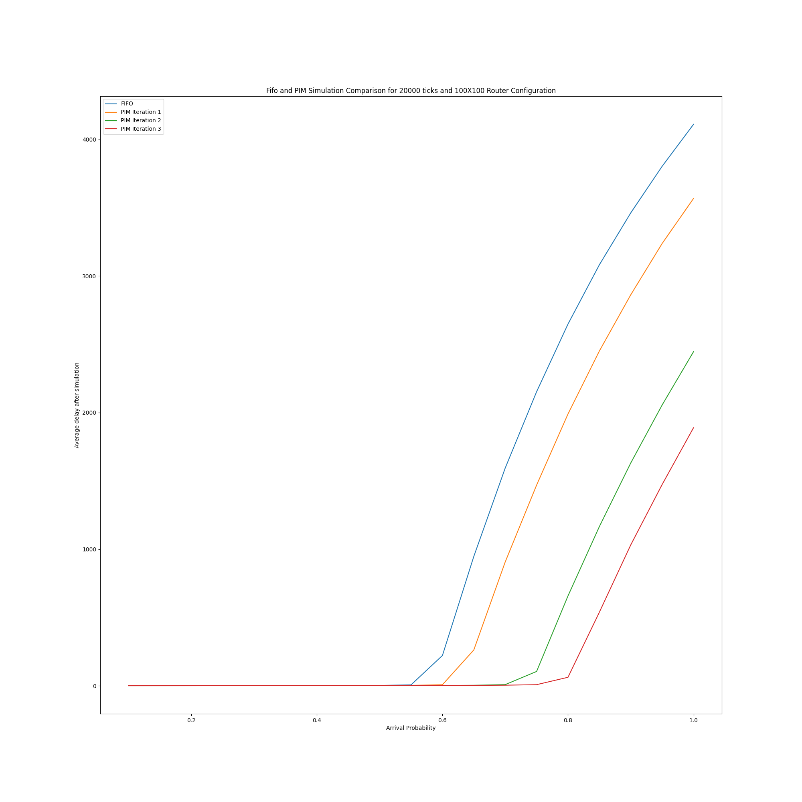

# Assignment 4: Extra Credit.    
By Junior Garcia     
NetID: jfg388

In this assignment, I implemented the First-In , First Out (FIFO) algorithm and the Parallel Iterative Match (PIM) algorithms for maximal matching in an input-queued router.


To run the FIFO algorithm:
```
python3 fifo.py [NUMBER OF ROUTERS] [ARRIVAL PROBABILITY BETWEEN 0 and 1] [RANDOM SEED]
```

To run the PIM algorithm:

```
python3 pim.py [NUMBER OF ROUTERS] [ARRIVAL PROBABILITY BETWEEN 0 and 1] [RANDOM SEED] [PIM ALGORITHM ITERATIONS]
```

## FIFO Graph
This Graph was generated through a python simulation consisting of a 100 X 100 Router architecture, 20,000 simulation ticks and a  random seed of 1.


To generate this graph, run the following command:

```
python3 fifo_graph.py 100 1
```
## PIM Graph
This Graph was generated through a python simulation consisting of a 100 X 100 Router architecture, 20,000 simulation ticks and a  random seed of 1.


To generate this graph, run the following command:

```
python3 pim_graph.py 100 1
```
## PIM and FIFO Graph Combined
This Graph was generated through a python simulation consisting of a 100 X 100 Router architecture, 20,000 simulation ticks and a  random seed of 1. Note that it takes a long time as the python script runs a simulation for PIM and FIFO separately.


To generate this graph, run the following command:

```
python3 fifo_pim_graph.py 100 1
```

