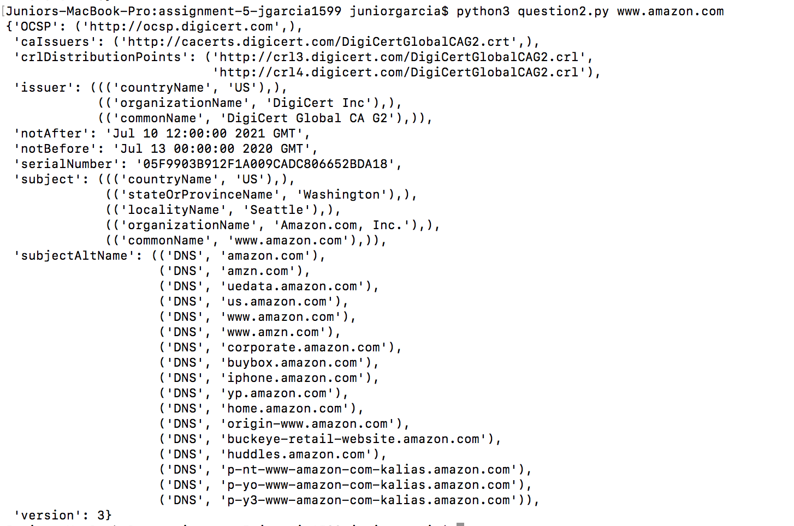
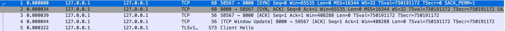

# Computer Networks Assignment 5
Name: Junior Garcia  
NetID: jfg388  


## Question 1

To run question 1:

```
python3 question1.py
```

**Outputs of requests**:

1024 message request to www.amazon.com


1024 message request to www.facebook.com


1024 message request to www.google.com


1024 message request to www.nytimes.com


4096 message request to www.nytimes.com


**Try increasing 1024 bytes to 4096 bytes. Does your output change? Why or why not?**

The output changes as we are requestion more bytes of data from the server, which in this case was filled out with additional content information that our client obtained from google, information that was cropped out on the smaller-sized 1024 request.


## Question 2

To run question2.py, write the following command:

```
python3 question2.py [hostname]
```
where hostname is the url address of the desired hostaname (i.e. www.google.com)

Example:
```
python3 question2.py www.google.com
```

**SSL Certificates Screenshots**:    

- Google

- Amazon

- Facebook

- NY Times


**What do the fields crlDistributionPoints, notAfter, and notBefore mean here?**
 
A CRL Distribution point (which can be found in the output screenshots for this question) is a server where a Certificate Authority publishes a lists of revoked/unallowed certificates that the server references in order to ignore requests from a possibly malicious client who wants to establish a connection. The field 'crldistributionpoint' contains the address of the crldistribution point the ssl certificate referenced in order to establish the connection with the client.  

The notAfter and notBefore fields both specify the time window the ssl certificate will be valid for. 


Resources:
- https://docs.pulsesecure.net/WebHelp/PCS/8.3R1/Content/PCS/PCS_AdminGuide_8.3/Understanding_CRLs.htm#:~:text=A%20CRL%20distribution%20point%20(CDP,you%20manually%20download%20the%20CRL.
- https://serverfault.com/questions/339469/details-on-exact-expiration-datetime-of-an-ssl-certificate

## Question 3

To create ```cert.pem```:
```
openssl req -new -x509 -days 365 -nodes -out cert.pem -keyout cert.pem
```

To run server on localhost:8000:

```
python3 question3_server.py
```

To send a message to the server,run the following client script which connects to the server running at localhost:8000 and sends a string that says "Hello":

```
python3 question3_client.py
```

## Question 4

TCP Handshake screenshot
In the screenshot below, you can see the three way TCP handshake needed in order for client to establish a connection with the server. 



Packets related to TLS


This packet contains the unencrypted message that was safely transmitted using TLS on top of TCP. On the inspector, we can see the message unencrypted already, but in the network the message was encrypted in order to provide security to the connection established between the client and the server after the TCP handshake. 


## Question 5
To implement the Diffie-Hellman key exchange, I used a traditional UDP client-server implementation, although this question does not rely on a client and a server but rather on two end-hosts that exchange information. 

To run  the server:

```
python3 question5_server.py
```

To run the client

```
python3 question5_client.py

```
The output for both terminal process should be the secret key that both the client and the server computed.


## Question 6: Extra Credit

The screen recording of me accessing the course's website using the Tor Browser can be found on ```torbrowserscreenrecording.mov```.

